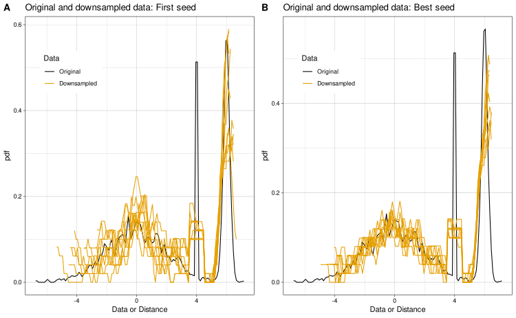

# opdisDownsampling

**opdisDownsampling** is an R package for optimal, *distribution-preserving, class-proportional down-sampling* of bio-medical data. It provides methods to reduce dataset size while maintaining both the class distribution and the statistical properties of the original data.

This repository contains the full source code of the package, as available on [CRAN][2], and is described in the [original publication](https://journals.plos.org/plosone/article?id=10.1371/journal.pone.0255838).

---

## Features

- **Distribution-Preserving Down-Sampling**: Selects a subset of samples whose statistical distribution closely matches the original dataset.




- **Class-Proportional Selection**: Maintains the proportions of different classes within the down-sampled data.
- **Parallel Computing Support**: Can exploit multiple CPU cores for efficient processing.
- **Flexible Test Statistics**: Supports several statistical tests for distribution comparison.

---

## Installation

You can install **opdisDownsampling** directly from source:

From CRAN:
```r
install.packages("opdisDownsampling")
```

From this GitHub repository:

```r
remotes::install_github("JornLotsch/opdisDownsampling")
```

Or manually by cloning the repository and running:

```r
devtools::install("path/to/opdisDownsampling")
```


---

## Usage

The main function is `opdisDownsampling()`.

### Basic Example

```r
library(opdisDownsampling)

data(iris)
Iris50percent <- opdisDownsampling(Data = iris[,1:4], Cls = as.integer(iris$Species),
  Size = 50, MaxCores = 1)
}

```

### Arguments

### Arguments

| Argument        | Description                                                                                                                                           |
|-----------------|-------------------------------------------------------------------------------------------------------------------------------------------------------|
| `Data`          | Numeric data frame or matrix to downsample                                                                                                            |
| `Cls`           | Class membership vector; if missing, all data assigned to one class                                                                                   |
| `Size`          | Proportion (0–1) or absolute number of rows to retain                                                                                                 |
| `Seed`          | Integer for reproducibility                                                                                                                           |
| `nTrials`       | Number of sampling trials (default: 1,000)                                                                                                            |
| `TestStat`      | Statistical test for distribution comparison (default: `"ad"`). Available options: `"ad"`, `"kuiper"`, `"cvm"`, `"wass"`, `"dts"`, `"ks"`, `"kld"`, `"amrdd"`, `"euc"` |
| `MaxCores`      | Maximum cores for parallel processing                                                                                                                 |
| `PCAimportance` | Use PCA for variable selection (logical)                                                                                                              |

### Available `TestStat` Options

| Value     | Description                                                                                  |
|-----------|----------------------------------------------------------------------------------------------|
| `"ad"`    | Anderson–Darling statistic                                                                   |
| `"kuiper"`| Kuiper statistic                                                                              |
| `"cvm"`   | Cramér–von Mises statistic                                                                    |
| `"wass"`  | Wasserstein distance                                                                          |
| `"dts"`   | Distributional Transform Statistic                                                            |
| `"ks"`    | Kolmogorov–Smirnov statistic                                                                  |
| `"kld"`   | Kullback–Leibler divergence (via `KullbLeiblKLD2()`)                                          |
| `"amrdd"` | Average Mean Root of Distributional Differences (via `amrdd()`)                               |
| `"euc"`   | Euclidean distance (via `EucDist()`)                                                          |


### Output

Returns a list containing:

- `ReducedData`: Down-sampled data frame
- `RemovedData`: Data not included in the sample
- `ReducedInstances`: Row names of the reduced data

---

## Documentation

See the [reference manual](https://cran.r-project.org/web/packages/opdisDownsampling/opdisDownsampling.pdf) for full function documentation.

- **Original article describing the method:**  
  "Optimal distribution preserving down‐sampling of bio‐medical data"  
  [PLoS ONE 16(8): e0255838](https://journals.plos.org/plosone/article?id=10.1371/journal.pone.0255838)

---

## Authors and License

- **Jorn Lotsch** (author, maintainer)  
- **Sebastian Malkusch** (author)  
- **Alfred Ultsch** (author)  
- License: GPL-3

---

## Citing opdisDownsampling

If you use this package, please cite the CRAN package and the original paper (see above).

---

## Related Links

- [CRAN package page][2]
- [Original publication (PLoS ONE)](https://journals.plos.org/plosone/article?id=10.1371/journal.pone.0255838)

[2]: https://cran.r-project.org/package=opdisDownsampling
[5]: https://cran.r-project.org/web/packages/opdisDownsampling/opdisDownsampling.pdf
