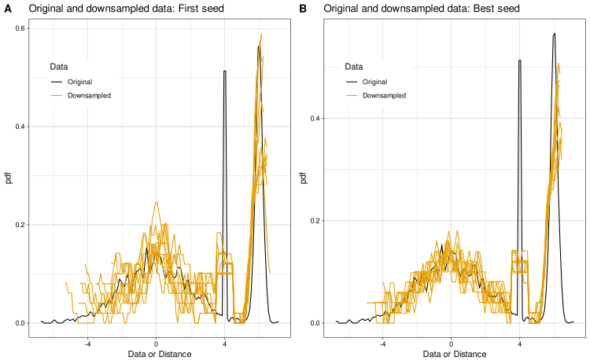

# opdisDownsampling: An optimized method for distribution-preserving class-proportional downsampling of biomedical data.


**opdisDownsampling** is an R package for optimal, *distribution-preserving, class-proportional down-sampling* of bio-medical data. It provides methods to reduce dataset size while maintaining both the class distribution and the statistical properties of the original data.

This repository contains the full source code of the package, as available on [CRAN](https://cran.r-project.org/package=opdisDownsampling), and is described in the [original publication](https://journals.plos.org/plosone/article?id=10.1371/journal.pone.0255838).

---

## Features

- **Distribution-preserving downsampling**: Selects a subset of samples whose statistical distribution closely matches the original dataset.




- **Class-proportional selection**: Maintains the proportions of different classes within the down-sampled data.
- **Parallel computing support**: Can exploit multiple CPU cores for efficient processing.
- **Flexible test statistics**: Supports several statistical tests for distribution comparison.

---

## Installation

You can install **opdisDownsampling** directly from source:

From CRAN:
```r
install.packages("opdisDownsampling")
```

From this GitHub repository:

```r
remotes::install_github("JornLotsch/opdisDownsampling")
```

Or manually by cloning the repository and running:

```r
devtools::install("path/to/opdisDownsampling")
```


---

## Usage

The main function is `opdisDownsampling()`.

### Basic example

```r
library(opdisDownsampling)

data(iris)
Iris50percent <- opdisDownsampling(Data = iris[,1:4], Cls = as.integer(iris$Species),
  Size = 50, Seed = 42, MaxCores = 1)
```

### Memory-efficient processing for large datasets

```r
# Automatic memory optimization for large datasets
LargeDataSample <- opdisDownsampling(Data = large_dataset, 
  Size = 0.1, Seed = 42, nTrials = 5000, JobSize = NULL, verbose = TRUE)
  
# Custom chunk size for fine-tuned memory control
CustomSample <- opdisDownsampling(Data = my_data, 
  Size = 100, Seed = 42, nTrials = 2000, JobSize = 50)
```

### Arguments

| Argument | Description |
| --- | --- |
| `Data` | Numeric data frame or matrix to downsample |
| `Cls` | Class membership vector; if missing, all data are assigned to one class |
| `Size` | Proportion (0–1) or absolute number of rows to class-proportionally retain |
| `Seed` | Seed control. Options: `"auto"` for seed recovery, `"simple"` to generate and report a seed using the current RNG state, or an integer for exact reproducibility. Use integers for systematic testing and fully reproducible analyses. |
| `nTrials` | Number of sampling trials. Default: `1000` |
| `TestStat` | Statistical test for distribution comparison. Default: `"ad"`. Available options: `"ad"`, `"kuiper"`, `"cvm"`, `"wass"`, `"dts"`, `"ks"`, `"kld"`, `"amrdd"`, `"euc"`, `"nent"`. |
| `MaxCores` | Maximum cores for parallel processing |
| `PCAimportance` | Use PCA for variable selection |
| `JobSize` | Number of trials per chunk. Use `0` for no chunking, `NULL` for automatic memory-aware chunk-size calculation, or a positive integer for manual chunking. |
| `verbose` | Print diagnostic information about memory usage and chunking |

### Available `TestStat` options

| Value     | Description                                                                                  |
|-----------|----------------------------------------------------------------------------------------------|
| `"ad"`    | Anderson–Darling statistic                                                                   |
| `"kuiper"`| Kuiper statistic                                                                              |
| `"cvm"`   | Cramér–von Mises statistic                                                                    |
| `"wass"`  | Wasserstein distance                                                                          |
| `"dts"`   | Distributional Transform Statistic                                                            |
| `"ks"`    | Kolmogorov–Smirnov statistic                                                                  |
| `"kld"`   | Kullback–Leibler divergence (via `KullbLeiblKLD2()`)                                          |
| `"amrdd"` | Average Mean Root of Distributional Differences (via `amrdd()`)                               |
| `"euc"`   | Euclidean distance (via `EucDist()`)                                                          |
| `"nent"`  | Absolute normalized entropy difference (via `abs_norm_entropy_diff()`) |


### Variable Selection Method
The package offers PCA based variable selection approaches:
#### PCA-based Selection (`PCAimportance = TRUE`)
- Identifies variables with high loadings in principal components
- Focuses on variables that capture the most variance in the data
- Useful for dimensionality reduction while preserving data structure

### Memory Optimization
The package automatically optimizes memory usage through intelligent chunking:
- **Automatic chunk sizing**: Considers data dimensions, available system memory, and number of processor cores
- **Memory-constrained processing**: Prevents memory exhaustion on large datasets or high trial counts
- **Adaptive strategy**: Uses larger chunks for small datasets (efficiency) and smaller chunks for large datasets (memory safety)
- **Diagnostic output**: Enable `verbose = TRUE` to understand memory usage patterns

**Memory optimization is particularly beneficial for:**
- Large datasets (>100MB)
- High trial counts (>1000 trials)
- Memory-constrained systems
- Datasets with many variables or observations


### Output

Returns a list containing:

- `ReducedData`: Down-sampled data frame
- `RemovedData`: Data not included in the sample
- `ReducedInstances`: Row names of the reduced data
- `RemovedInstances`: Row names of the removed data

---

## Performance Tips
### For Large Datasets
- Use `JobSize = NULL` to enable automatic memory-aware chunk-size calculation.
- Use `verbose = TRUE` to monitor memory usage and chunking diagnostics.
- Consider using fewer trials initially to estimate processing time.

### For Memory-Constrained Systems
- Use `JobSize = NULL` for automatic chunk-size calculation, or manually set smaller values such as `JobSize = 10` or `JobSize = 25`.
- Monitor system memory usage during processing.
- Use a smaller `MaxCores` value to reduce parallel memory overhead.

### For Small Datasets
- The default `JobSize = 0` processes all trials in a single batch.
- Manual chunk-size specification is usually not needed for small datasets.
- Higher trial counts can usually be used without memory concerns.


## Documentation

See the [reference manual](https://cran.r-project.org/web/packages/opdisDownsampling/opdisDownsampling.pdf) for full function documentation.

- **Original article describing the method:**  
  "Optimal distribution preserving down‐sampling of bio‐medical data"  
  [PLoS ONE 16(8): e0255838](https://journals.plos.org/plosone/article?id=10.1371/journal.pone.0255838)

---

## Authors and license

- **Jorn Lotsch** (author, maintainer)  
- **Sebastian Malkusch** (author)  
- **Alfred Ultsch** (author)  
- License: GPL-3

---

## Citing opdisDownsampling

If you use this package, please cite the CRAN package and the original paper:

Lötsch J, Malkusch S, Ultsch A. Optimal distribution-preserving downsampling of large biomedical data sets (opdisDownsampling). PLoS One. 2021 Aug 5;16(8):e0255838. doi: 10.1371/journal.pone.0255838. PMID: 34352006; PMCID: PMC8341664.

---

## Related links

- [CRAN package page](https://cran.r-project.org/package=opdisDownsampling) (check and compare versions)
- [Original publication (PLoS ONE)](https://journals.plos.org/plosone/article?id=10.1371/journal.pone.0255838)

