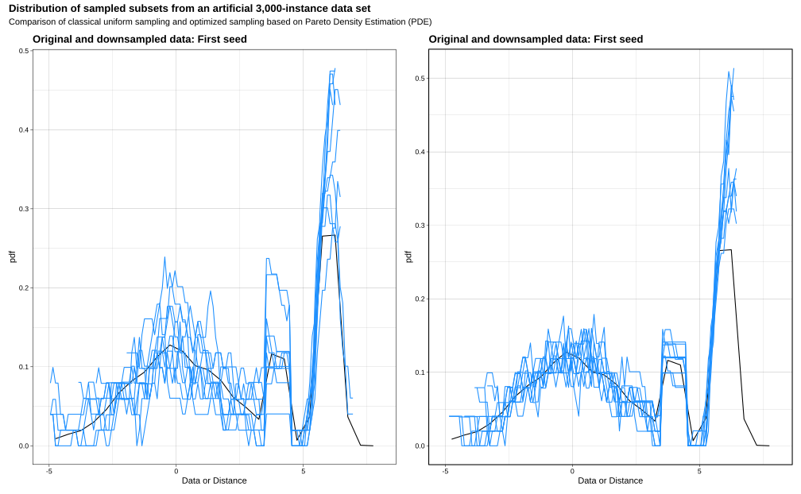

# opdisDownsampling: Distribution-preserving class-proportional downsampling for biomedical data

**opdisDownsampling** is an R package for optimal, *distribution-preserving, class-proportional down-sampling* of biomedical data. It reduces dataset size while preserving class proportions and the statistical structure of the original data.

This repository contains the package source and documentation.

---

## Features

- **Distribution-preserving downsampling**: Selects a subset of samples whose statistical distribution closely matches the original dataset.



*Figure adapted from: Lötsch J, Malkusch S, Ultsch A (2021). Optimal distribution-preserving downsampling of large biomedical data sets (opdisDownsampling). PLOS ONE. https://doi.org/10.1371/journal.pone.0255838* (see "Reference" paragraph below)

- **Class-proportional selection**: Maintains the proportions of different classes within the down-sampled data.
- **Parallel computing support**: Can exploit multiple CPU cores for efficient processing.
- **Flexible test statistics**: Supports several options for distribution comparison.

---

## Installation

You can install **opdisDownsampling** directly from source:

From CRAN:
```r
install.packages("opdisDownsampling")
```

From this GitHub repository:

```r
remotes::install_github("JornLotsch/opdisDownsampling")
```

Or manually by cloning the repository and running:

```r
devtools::install("path/to/opdisDownsampling")
```


---

## Usage

The main function is `opdisDownsampling()`.

### Basic example

```r
library(opdisDownsampling)

data(iris)
Iris50percent <- opdisDownsampling(Data = iris[,1:4], Cls = as.integer(iris$Species),
  Size = 50, Seed = 42, MaxCores = 1)
```

### Memory-efficient processing for large datasets

```r
set.seed(42)

# Small synthetic dataset for the first example
large_dataset <- data.frame(
  class = sample(c("A", "B"), 2000, replace = TRUE),
  x1 = rnorm(2000),
  x2 = runif(2000),
  x3 = rpois(2000, lambda = 3)
)

# Smaller synthetic dataset for the second example
my_data <- data.frame(
  class = sample(c("A", "B"), 300, replace = TRUE),
  x1 = rnorm(300),
  x2 = runif(300)
)

# Automatic memory optimisation for large datasets (for demonstration purposes, a relatively small 'large'  dataset is generated).
LargeDataSample <- opdisDownsampling(
  Data = large_dataset[,2:ncol(large_dataset)],
  Size = 0.1,
  Seed = 42,
  nTrials = 5000,
  JobSize = NULL,
  verbose = TRUE
)

# Custom chunk size for fine-tuned memory control
CustomSample <- opdisDownsampling(
  Data = my_data[,2:ncol(my_data)],
  Size = 100,
  Seed = 42,
  nTrials = 2000,
  JobSize = 500
)
```

### Arguments

| Argument | Description |
| --- | --- |
| `Data` | Numeric data frame or matrix to downsample |
| `Cls` | Class membership vector; if missing, all data are assigned to one class |
| `Size` | Proportion (0–1) or absolute number of rows to class-proportionally retain |
| `Seed` | Seed control. Options: `"auto"` for seed recovery, `"simple"` to generate and report a seed using the current RNG state, or an integer for exact reproducibility. Use integers for systematic testing and fully reproducible analyses. |
| `nTrials` | Number of sampling trials. Default: `1000` |
| `TestStat` | Statistical test for distribution comparison. Default: `"ad"`. Available options: `"ad"`, `"kuiper"`, `"cvm"`, `"wass"`, `"dts"`, `"ks"`, `"kld"`, `"amrdd"`, `"euc"`, `"nent"`. |
| `MaxCores` | Maximum cores for parallel processing |
| `PCAimportance` | Use PCA for variable selection |
| `CheckRemoved` | Logical value; if `TRUE`, also optimizes the removed data for distributional similarity to the original data. Default: `FALSE` |
| `JobSize` | Number of trials per chunk. Use `0` for no chunking, `NULL` for automatic memory-aware chunk-size calculation, or a positive integer for manual chunking. |
| `verbose` | Print diagnostic information about memory usage and chunking |

### Available `TestStat` options

| Value     | Description                                                                                  |
|-----------|----------------------------------------------------------------------------------------------|
| `"ad"`    | Anderson–Darling statistic                                                                   |
| `"kuiper"`| Kuiper statistic                                                                              |
| `"cvm"`   | Cramér–von Mises statistic                                                                    |
| `"wass"`  | Wasserstein distance                                                                          |
| `"dts"`   | Distributional Transform Statistic                                                            |
| `"ks"`    | Kolmogorov–Smirnov statistic                                                                  |
| `"kld"`   | Kullback–Leibler divergence (via `KullbLeiblKLD2()`)                                          |
| `"amrdd"` | Average Mean Root of Distributional Differences (via `amrdd()`)                               |
| `"euc"`   | Euclidean distance (via `EucDist()`)                                                          |
| `"nent"`  | Absolute normalized entropy difference (via `abs_norm_entropy_diff()`) |


### Variable Selection Method
The package offers PCA based variable selection approaches:
#### PCA-based Selection (`PCAimportance = TRUE`)
- Identifies variables with high loadings in principal components
- Focuses on variables that capture the most variance in the data
- Useful for dimensionality reduction while preserving data structure

### Memory Optimization
The package automatically optimizes memory usage through intelligent chunking:
- **Automatic chunk sizing**: Considers data dimensions, available system memory, and number of processor cores
- **Memory-constrained processing**: Prevents memory exhaustion on large datasets or high trial counts
- **Adaptive strategy**: Uses larger chunks for small datasets (efficiency) and smaller chunks for large datasets (memory safety)
- **Diagnostic output**: Enable `verbose = TRUE` to understand memory usage patterns

**Memory optimization is particularly beneficial for:**
- Large datasets (>100MB)
- High trial counts (>1000 trials)
- Memory-constrained systems
- Datasets with many variables or observations


### Output

Returns a list containing:

- `ReducedData`: Down-sampled data frame
- `RemovedData`: Data not included in the sample
- `ReducedInstances`: Row names of the reduced data
- `RemovedInstances`: Row names of the removed data

---

### Handling missing values

`opdisDownsampling()` also works with data containing missing values.

```r
library(opdisDownsampling)

set.seed(42)
iris_data <- data.frame(iris[, 1:4])

n_na <- round(0.05 * nrow(iris_data) * ncol(iris_data))
na_pos <- sample(nrow(iris_data) * ncol(iris_data), n_na)

x <- as.matrix(iris_data)
x[na_pos] <- NA
iris_with_missing <- as.data.frame(x)
iris_with_missing

downsampled_missing <- opdisDownsampling(
  Data = iris_with_missing,
  Cls = iris$Species,
  Size = 0.8,
  Seed = 42
)

downsampled_missing
```

## Performance Tips
### For Large Datasets
- Use `JobSize = NULL` to enable automatic memory-aware chunk-size calculation.
- Use `verbose = TRUE` to monitor memory usage and chunking diagnostics.
- Consider using fewer trials initially to estimate processing time.

### For Memory-Constrained Systems
- Use `JobSize = NULL` for automatic chunk-size calculation, or manually set smaller values such as `JobSize = 10` or `JobSize = 25`.
- Monitor system memory usage during processing.
- Use a smaller `MaxCores` value to reduce parallel memory overhead.

### For Small Datasets
- The default `JobSize = 0` processes all trials in a single batch.
- Manual chunk-size specification is usually not needed for small datasets.
- Higher trial counts can usually be used without memory concerns.


## Documentation

See the [CRAN package page](https://CRAN.R-project.org/package=opdisDownsampling) for full documentation and the reference manual.

- **Original article describing the method:**  
  "Optimal distribution preserving down‐sampling of bio‐medical data"  
  [PLoS ONE 16(8): e0255838](https://journals.plos.org/plosone/article?id=10.1371/journal.pone.0255838)

---

## Authors and license

- **Jorn Lotsch** (author, maintainer)  
- **Sebastian Malkusch** (author)  
- **Alfred Ultsch** (author)  
- License: GPL-3

---

## Reference
### Citing opdisDownsampling

If you use this package, please cite the CRAN package and the original paper:

Lötsch J, Malkusch S, Ultsch A. Optimal distribution-preserving downsampling of large biomedical data sets (opdisDownsampling). PLoS One. 2021 Aug 5;16(8):e0255838. doi: 10.1371/journal.pone.0255838. PMID: 34352006; PMCID: PMC8341664.

---

## Related links

- [CRAN package page](https://cran.r-project.org/package=opdisDownsampling) (check and compare versions)
- [Original publication (PLoS ONE)](https://journals.plos.org/plosone/article?id=10.1371/journal.pone.0255838)

